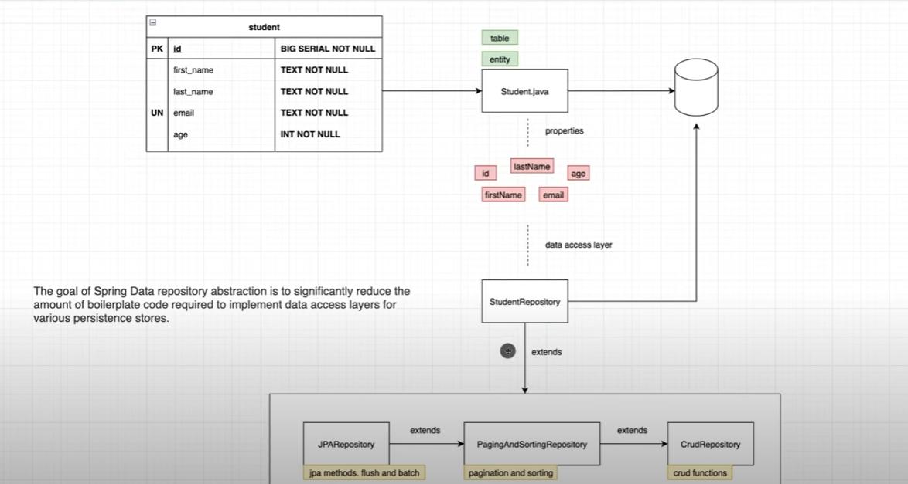

# Proyecto de Spring Data Jpa
Proyecto basado en videotutorial de https://youtu.be/8SGI_XS5OPw
se ven conceptos importantes como:
What is Spring Data JPA
► Connect to a real database and not in memory DB
► How to map classes to tables
► Hibernate Entity Life Cycle
► Queries and JPA Repositories
► Paging and Sorting
► 1 to 1 Relationships
► 1 to Many Relationships
► Many to Many relationships
► Transactions

